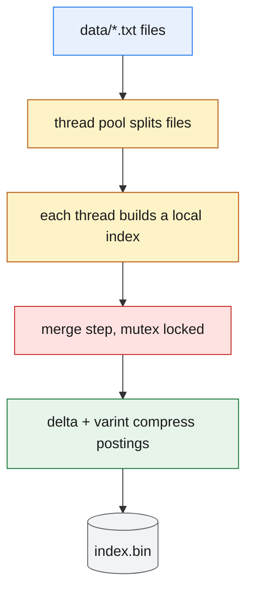
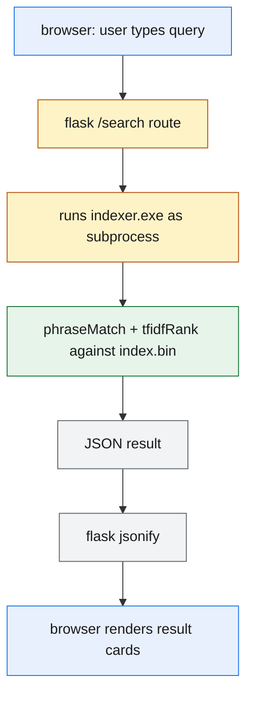

# Local Search Engine

a small search engine for a folder of text files. indexes every word and line,
then supports exact phrase search and tf-idf ranked search through a web UI.

## Stack

- `src/indexer.cpp` — builds the index and runs queries, multithreaded
- `app.py` — flask bridge between the browser and the indexer binary
- `templates/`, `static/` — the search UI

## How it works

1. `indexer build data/ index.bin` reads every `.txt` file in `data/`, splits
   it across threads, and records the position of every word (and which line
   it's on).
2. those positions are compressed before being written to disk.
3. `indexer search index.bin <query>` loads the index and returns matches as
   JSON — both an exact phrase match and a tf-idf ranked list.
4. `app.py` calls the indexer binary as a subprocess and serves the results
   to the page.

### Build Flow



### Search Flow



## Index Structure (hash maps)

the index is a hash map: `word -> doc_id -> list of positions`
(`unordered_map<string, unordered_map<int, vector<int>>>`).

- **lookup is O(1) average** because `unordered_map` hashes the key (the
  word) straight to a bucket, instead of scanning or doing a binary search
  like a sorted array/tree would (O(log n)). searching for `"fox"` costs the
  same whether the index has 100 words or 1 million.
- **what's stored per word:** every position it occurred at (for phrase
  matching) and every line number it occurred on (for displaying results) —
  two parallel hash maps, `RawIndex` and `RawLineIndex`.
- hashing itself doesn't shrink memory — it just makes lookup fast. the
  memory savings come from compression (below), applied on top of the hash
  map's values.

## Optimizations

| optimization | what it buys |
|---|---|
| hash map (`unordered_map`) instead of sorted array | O(1) average lookup per word |
| multithreaded build | files indexed in parallel, merged once at the end |
| delta + varint compression | ~3-4x smaller posting lists on disk and in memory |
| single-pass line fetch (`getLinesSinglePass`) | reads each needed file once, not once per matched line |

## Delta + Varint compression

storing every word position as a raw 4-byte int wastes space, since
positions in a posting list are sorted and usually close together. instead:

1. store the *difference* from the previous position, not the position itself
2. encode that difference as a varint (1 byte per 7 bits, with a continuation
   bit), so small gaps cost 1 byte instead of 4

**example** — the word `"fox"` appears at word positions `[12, 14, 15, 40]`
in a document:

```
deltas:      12, 2, 1, 25
raw storage: 4 positions x 4 bytes = 16 bytes
compressed:  1 + 1 + 1 + 1 = 4 bytes   (each delta fits in one byte here)
```

on real text this gives roughly a 3-4x reduction, since most words repeat
close together rather than being spread evenly across a document.

## running it

```bash
g++ -std=c++17 -O2 -Wall -Wextra -o src/indexer.exe src/indexer.cpp
pip install flask
python app.py
```

open `http://localhost:5000`, type a query. add files to `data/` and click
**rebuild** to reindex.

## example query

searching `quick fox` against:

```
data/a.txt:  "the quick brown fox" / "the fox runs fast"
data/b.txt:  "the quick fox is clever"
```

returns `b.txt` as an exact phrase hit (line 1, "quick fox" appears
consecutively), and both files as ranked hits (each contains both words,
just not next to each other in `a.txt`).
